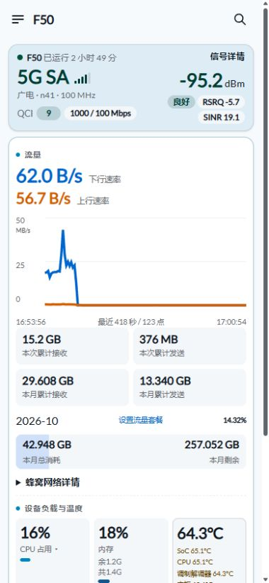
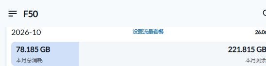

# 第十一章（可选）：页面美化与流量套餐面板

让 F50 的常用信息在手机上打开就能看见：大字号速率、单张双曲线、蜂窝用量、八核心负载和六个快捷控制。原生 OpenWrt 安装完成后，按需增加这套界面。

## 1. 复制给 Codex 的提示词

```text
给已安装 mu300-linux 的 F50 增加本仓库 docs/11-optional-dashboard.md 的可选首页优化。
先读取 README、versions.json、本章和 extras/dashboard/install.sh，识别实际版本、蜂窝接口、无线设备与管理连接。
本补丁匹配 v2026.10.11、OpenWrt 25.12.5、厂商 5.4 内核、sipa_eth0、radio0 / ap0 的 5GHz 无线。版本或接口不同，先适配差异；不要直接覆盖不匹配的页面。
电脑互联网继续走主路由网线，F50 USB 负责 SSH 管理。使用已有 SSH 配置，不公开密码、私钥、订阅或备份。
下载 / 准备代码与 vnstat2 依赖，核对 extras/dashboard/SHA256SUMS，备份原页面、后台采集脚本和配置，再部署。
保留当前密码、SSID、合法非 DFS 信道、套餐额度、历史数据库与 OpenClash / AdGuard Home 开关状态；原先为 DFS 信道时按本章保护策略改为非 DFS 自动选择。没有安装 OpenClash 时保持关闭样式并提示不可用，本扩展不安装代理插件或导入订阅，也不自动安装 AdGuard Home；已安装时按本章 Q&A 适配 DNS 联动。
安装后用实际浏览器验证手机布局、CPU 总占用、内存、CPU0–CPU7、上下行曲线、两组累计、套餐设置、月度历史和快捷控制；核对流量求和及百分比。
核对自动 / 手动信道及 DFS 拒绝结果，测试后恢复合法非 DFS 信道；重启类按钮检查确认流程，真正重启按当前任务安排。
记录本机备份路径、恢复命令与已验证结果，在本地 F50-progress.md 勾选。界面能用后再报告完成。
```

## 2. 手机首页有哪些变化

- **先看核心信息：** QCI、频段、上下行速率、温度、CPU 和内存常显；CPU 总占用、内存与四传感器平均温度常显，点击 CPU 占用展开 CPU0–CPU7 和频率；四传感器读数放在温度框内，左对齐。
- **大字号速率：** 蓝色下行与“5G SA”使用相同字号；橙色上行放在下方，略小一号。
- **一张双曲线：** 蓝 / 橙高对比线，3.5px 线宽；后台保留最近 5 分钟、最多 200 个采样点，点击或轻触查看采样时间、上下行速率。手机曲线高度 145px，纵轴三档数字、单位只显示一次。
- **两组流量：** 先显示“本次累计接收 / 发送”，再显示“本月累计接收 / 发送”。本次从当前启动的蜂窝接口计数读取，本月来自持久化数据库。
- **套餐进度条：** 左侧显示本月总消耗，右侧显示本月剩余；点击左侧编辑已使用，点击右侧编辑总流量。日期与百分比中间的“设置流量套餐”打开完整设置，点击日期查看月度历史。
- **六个快捷控制：** 手机两行各三个：第一行流量、性能 / 能效、4G / 自动 5G；第二行 OpenClash、AdGuard Home、频段和重启。桌面同顺序一行展示。
- **状态颜色：** 流量、Wi-Fi、OpenClash、AdGuard Home 开启蓝色、关闭白色，不重复显示状态文字。性能模式（8核）红色、能效模式（全小核）绿色；自动 5G 蓝色、4G 绿色。切换按钮显示“预计切换需 20 秒”；点击立即执行并显示 20 秒倒计时，确认联网恢复后提前结束；超过预计时间继续显示确认 / 等待网络恢复，150 秒未恢复时提示并解除按钮锁定。
- **更多操作：** “频段和重启”展开 Wi-Fi、信道、重启调制解调器、重启设备、切换到 Android，以及锁制式 / 频段、保存并应用、保存与复位。关闭 Wi-Fi、重启设备、切换到 Android 均需二次确认，取消不执行；开启 Wi-Fi 直接执行。
- **内存三行：** 内存、余 x.xG、共 x.xG，数值随系统更新；顶部保留占用百分比。
- **展开看详情：** 首模块左侧显示制式、运营商简称（广电）和频段，基站、小区、PCI 与频点编号移入蜂窝详情；运营商简称与频段同一行；QCI 与网络下发的上下行速率上限同一行，QCI 数值用信号质量胶囊，速率用 RSRQ 同款标签，省略 AMBR 字样（非实时吞吐）；信号详情常显在右侧，标题小字号、信号强度数值与 5G SA 同字号；蜂窝连接、无线 / 局域网 / 设备参数折叠。蜂窝详情显示 SIM 提供的手机号。锁制式与频段按钮展开邻区、设置入口以及“保存并应用 / 保存 / 复位”，首页底部不再单独占位。

手机首模块与负载、快捷控制实拍：




新版快捷控制（OpenClash 右侧增加 AdGuard Home，锁频段与重启合并）：



图中的速率、用量、温度属于截图时的读数；安装后由自己的设备实时采集，套餐总量由自己填写。

## 3. 准备与适用版本

- [ ] 主线安装已完成，LuCI、蜂窝连接与 USB SSH 正常。
- [ ] 核对 `/etc/mu300/image-version` 为 `v2026.10.11`，当前页面是 `view/mu300/home.js`。
- [ ] 核对 `/usr/libexec/unisoc-modem/dashboard-info`、蜂窝口 `sipa_eth0`、无线 `radio0 / ap0` 与 5GHz 配置。
- [ ] 使用 PowerShell、Python 3、Git 和电脑现有 OpenSSH；软件下载与准备交给 Codex。
- [ ] 保留当前 SSH Host 与管理地址，记录原信道和已有套餐设置。

这是一套固定版本的 **LuCI 首页与采集脚本补丁**。它更新前端、对应 RPC / ACL 和逐核心采集，不写启动槽、Android 分区或内核。Wi-Fi 信道由快捷按钮按当前国家码、频段和带宽筛选；安装本身保留当前无线设置。

新版本 mu300-linux 的页面、RPC 或无线结构变化时，先对照作者新版本适配。软件与底层驱动继续由 [dikeckaan/mu300-linux](https://github.com/dikeckaan/mu300-linux) 提供。

## 4. 安装依赖与部署

先在 F50 SSH 中核对软件源并安装统计工具：

```sh
cat /etc/mu300/image-version
ip link show sipa_eth0
apk update
apk add vnstat2
vnstat --version
```

本方案不安装额外内核模块。已有 vnstat2 时核对版本、接口和数据库即可。

在 **仓库根目录**的 Windows PowerShell 执行，`f50` 是前文设置好的 SSH Host：

```powershell
python .\extras\dashboard\deploy.py --host f50
```

没有 Host 别名时，可用 `--host root@192.168.50.1`，地址换成自己的管理地址。SSH 使用电脑现有配置与主机指纹校验，脚本不保存登录密码。

部署脚本用 Python 标准库打包，通过 SSH 原始字节传输；不依赖路由器 SFTP。设备端核对文件 SHA256 与版本，创建带时间戳的私有备份，再安装页面、采集脚本、RPC 与 ACL。

安装后重启 rpcd，因此网页需要重新登录；浏览器强制刷新首页。原有密码、SSID、信道和代理配置保持现有设置，套餐已有配置继续使用；首次安装额度为 0，打开“设置流量套餐”填写自己的总量。

- [ ] 安装输出了原页面备份目录与恢复命令。
- [ ] 浏览器重新登录后显示新首页。
- [ ] 更新本机进度清单，保存安装输出。

## 5. 月度用量怎样保存

- **统计范围：** 仅统计蜂窝口 `sipa_eth0` 的接收 + 发送，包含路由器自身流量；USB 与 Wi-Fi 转发不再重复累加。
- **持久存储：** vnStat 数据库放在 SD 根文件系统的持久路径。已有持久目录继续使用；原目录在 `/var` / `/tmp` 时，安装器迁移到 `/opt/vnstat`。新旧目录都有数据库时先处理合并，不覆盖历史记录。
- **自然月：** 每月 1 日开始新月份，额度沿用；月度历史自动保存。本扩展使用自然月账期。
- **已使用输入：** 修改“本月已使用”会保存当月校准差值，后续采样继续增加；只修改总量不会重置已用。月度接收 / 发送是实际接口记录，总消耗还包含已设置的校准值。
- **保存周期：** 每 5 分钟写入 SD，网页每 30 秒读取。突然断电可能丢失最近一个保存周期的数据，日常使用正常关机 / 重启。
- **起算时间：** 自动记录从启用采集开始，Android 运行期间的流量由套餐查询后填写已使用值补充。运营商计费按运营商查询核对。

曲线与状态由开机后台服务持续采集，关闭网页仍记录；再次打开先读取已有曲线与最新状态。短期记录保存在 `/tmp/f50-dashboard-live` 内存目录，保留最近 5 分钟、最多 200 点，设备重启后重新积累；月度数据库与套餐设置在 SD 上持续保存。曲线是速率，不是蜂窝测速结果；无需为了显示曲线额外消耗流量测速。

## 6. 持续采集与登录会话

`f50history` 服务随 OpenWrt 启动，在后台读取蜂窝计数，目标采样间隔 3 秒；每三轮读取 MU300 完整状态。完整状态采集所需时间计入实际采样间隔，曲线按时间戳计算速率。前端请求 `f50history.status` 读取缓存，避免每次打开网页从零开始，或多个网页重复触发完整采集。

后台状态、历史与上一轮 CPU 计数保存在权限为 700 的内存目录，经登录后的 RPC / ACL 读取。采集不发送测速流量，不频繁写 SD 卡。首轮或服务刚启动且缓存未就绪时，页面回退到原始状态采集；网页重新打开不会清空已有历史。

安装器把 `luci.sauth.sessiontime` 设置为 7200 秒（2 小时）。这是登录会话参数；`rpcd.@rpcd[0].timeout` 控制 RPC 程序执行超时，保留原值，不能用它延长登录。重新登录后核对新会话时长；重启 rpcd、重启设备或主动退出仍会使登录失效。

验收：离开首页 15 秒，通过 SSH 对比后台采样数，再打开首页，确认曲线起始时间早于此次打开时间，CPU / 温度已有数值。安装器包含开机服务、RPC 与 ACL，恢复脚本还原原配置和服务启用状态。

## 7. OpenClash 与 AdGuard Home 的可选联动

OpenClash 按钮只管理已经安装、已经配置好的 OpenClash。没有安装时保留白色按钮并显示状态不可用提示，其他面板功能照常使用。需要安装代理时进入 [OpenClash 可选章节](06-openclash.md)。

没有运行 AdGuard Home 时，按钮调用 OpenClash 自身启动 / 停止流程。有自定义 DNS 链时，核对停止代理后直连解析能恢复。

已经运行 AdGuard Home 时，本补丁沿用本次联动方案：dnsmasq → AdGuard Home `5353` → Mihomo `7874`。开关切换时同步 AGH 上游，关闭代理使用直连 DNS。先在本机配置 AGH API 地址和凭据：

```sh
uci set f50dashboard.main=main
uci set f50dashboard.main.adguard_url='http://192.168.50.1:3000'
uci commit f50dashboard
```

地址使用自己的 AGH 管理地址。由 Codex 在本机创建 `/etc/f50openclash-adguard.netrc`，内容格式为 `machine <AGH地址的主机部分> login <自己的用户名> password <自己的密码>`，权限设为 `600`。凭据只留在设备与自己的私有备份，不提交 GitHub。

如果 AGH 端口、Mihomo DNS 端口或 DNS 链与上面不同，先适配 `f50openclash-worker`，重新生成 SHA256，再部署。切换后核对核心状态、DNS 上游与正常网页访问；不以按钮颜色单独判断联网结果。

## 8. 实际验收与恢复

Codex 逐项检查后，在本机清单勾选：

- [ ] 360px / 390px 手机宽度没有横向溢出，CPU 总占用 / 内存 / 温度默认显示，点击 CPU 展开八核心。
- [ ] 上下行两条曲线颜色、线宽、点击读数符合页面设计。
- [ ] 本次计数对应当前启动接口；本月接收 + 发送对应数据库，未校准时等于本月总消耗。
- [ ] 套餐总量可自己输入；保存后刷新页面，额度和已用基线仍在。
- [ ] 月度历史可打开，数据库在持久目录，重启后继续采集。
- [ ] 六个快捷按钮顺序正确，状态与后台一致。
- [ ] 自动 / 手动信道能应用，测试后恢复原设置。
- [ ] 重启类按钮有确认流程；实际重启按用户当前安排执行。
- [ ] 离开网页后后台采样继续增加，重新打开立即显示此前曲线与状态。
- [ ] 新登录会话为 7200 秒，RPC 执行超时保持原值。
- [ ] 留存原页面、配置、安装输出与最终备份。

本次界面已在 360px / 390px 宽度检查；八核心数据、流量求和、百分比、设置保存、曲线读数、折叠区和信道自动 / 手动均经过实际页面检查。自动模式实测选到 157 / 80MHz，随后恢复手动 36；重启类按钮检查确认流程。

安装器输出的备份目录形如 `/root/f50-dashboard-backups/<时间戳>-<编号>`。恢复时使用自己实际输出的路径：

```sh
sh /root/f50-dashboard-backups/<实际目录>/restore.sh
```

恢复脚本还原原页面、采集脚本、RPC / ACL 和配置，并恢复 vnStat 之前的启用状态；流量数据库保留，不删除历史。重新登录并强制刷新页面。界面确认可用后再按 [完整备份章节](07-backup-and-restore.md) 保存最终系统。

## 9. 性能 / 能效模式

**性能模式（8核）**开启全部核心，用 `mu300-toolkit profile balanced` 保留按负载动态调频；按钮为红色。**能效模式（全小核）**开启 CPU0–CPU3 四个小核、关闭 CPU4–CPU7 大核，调用上游 `profile eco`；按钮为绿色。本机小核最高频率为 1.105 GHz，实际以设备频率表为准。

这套模式保留内核温控、电压表、蜂窝频段和 Wi-Fi 功率设置。安装只增加服务和按钮，保留既有模式；首次安装无既有模式时采用全核，用户点击后再切换。选择写入 `f50dashboard.power.mode`，开机服务恢复选择。切换失败或管理服务健康检查失败时恢复全核。

本机两小核模式在当前 Wi-Fi 驱动与中断负载下接近满载，改为全小核后短时采样约 34%，页面随后约 43%–55%。这是当时负载下的观察，不是固定利用率或吞吐保证；目标是给上网与后台服务留出余量。流量大、代理规则多或单核中断繁忙时，按实际速率、延迟、逐核心负载选择全核。

Codex 验收时核对 `/sys/devices/system/cpu/online`：能效为 `0-3`，性能为 `0-7`，同时检查管理页面、蜂窝连接和 Wi-Fi。不要以绿色按钮代替实际核心与联网检查。

## 10. Q&A

**AdGuard Home 开关怎样使用？** 按钮位于 OpenClash 右侧，蓝色开启、白色关闭。本补丁不安装 AdGuard Home；需要已有 `/etc/init.d/adguardhome` 服务和仅在本机保存的 `/etc/f50openclash-adguard.netrc` API 凭据（权限 `600`）。管理 API 默认取当前 LAN 地址的 `3000` 端口，可用 `f50dashboard.main.adguard_url` 指定。凭据、订阅和配置数据库不属于公开附件。

让 Codex 先备份并核对现有 DNS 链路，再接入：dnsmasq 监听 `53`，AdGuard Home 监听 `127.0.0.1:5353`，OpenClash DNS 监听 `127.0.0.1:7874`。两个都开时，路径为 dnsmasq → AdGuard Home → OpenClash；只开一个时接到该服务；两个都关时恢复 WAN DNS。`f50-dns-route` 随切换清理缓存；两个快捷开关共用互斥锁，关闭 AdGuard Home 不停止 OpenClash。

现有 AdGuard Home 启停脚本若强制修改 dnsmasq 上游，需要移除该旧逻辑，改为启动就绪后调用 `/usr/libexec/f50-dns-route auto`；OpenClash 自定义防火墙钩子也调用同一 helper，保留原钩子其他内容。核对 OpenClash 的 DNS 重定向模式后设置适合该链路的 `enable_redirect_dns=1`；这些属于本机插件适配，安装器不会覆盖已有插件启停脚本或防火墙钩子。未经适配不要把快捷开关视为已验收。

验收四种开关组合，每种分别检查 DNS 与网页访问；关闭 AdGuard Home 时核对 Clash PID 不变，最后恢复用户原来的开关状态。本机四种组合已通过 DNS 和直连 HTTPS 检查，代理站点还取决于订阅节点。遇到某个网页循环刷新，核对该域名的拦截记录与代理连接，不能直接认定是广告过滤。

**OpenClash 开启后绕过了 AdGuard Home？** OpenClash 的异步启动会在核心出现后再次写入 dnsmasq 上游；只在快捷开关或防火墙钩子里修正，可能被后续步骤覆盖。适配完成后执行 `sh extras/dashboard/f50-openclash-dns-order.sh`，让 OpenClash 写入上游时先识别 AdGuard Home，并在 `change_dnsmasq` 步骤后重新协调上游。再执行 `sh extras/dashboard/f50-openclash-watchdog-dns.sh`，让每分钟运行的守护检查接受 5353，并在快捷开关切换期间暂停 DNS 强制修正。启动脚本与守护脚本必须一起适配，否则守护程序仍可能覆盖 DNS。脚本先备份原启动文件，重复执行不会重复插入；插件升级覆盖启动或守护文件后需重新核对并应用两个补丁。两者都开时必须实际检查 dnsmasq 上游为 `127.0.0.1#5353`、AdGuard Home 上游为 `127.0.0.1:7874`，不能只以网页可访问判断过滤生效。

**页面出来了，数字和曲线却要等很久？** 首屏现在随已登录的首页 HTML 返回后台最新状态和最近五分钟曲线，页面绘制时直接读取，不再等一次状态 RPC。状态 RPC 使用独立请求，快捷开关与套餐请求随后加载；页面每 3 秒更新，后台采集不依赖浏览器是否打开。安装器只向现有 Aurora 模板插入快照，保留自己的主题设置，并更新 LuCI 资源版本使手机读取新代码。登录页不包含状态快照。

本机经 USB 检查：登录响应约 0.12–0.14 秒，已登录首页约 0.03 秒，状态 HTTP 接口约 0.02 秒；浏览器刷新后首屏已有速率、信号、CPU、温度与 89 个曲线点，随后套餐和开关正常显示。这些是本机测量，手机总耗时还包含 Wi-Fi 传输与浏览器绘制，按自己的手机检查。

2026-10-09 再次核对：登录响应 0.134 秒、首页 0.025 秒、状态接口 0.015 秒，所有首页模块可见；公开包 SHA256、Shell 和 JavaScript 语法检查通过，补丁重复执行只保留一份首屏快照。安装器同时备份无线配置、`mu300-hw` 和两份 LuCI 模板，恢复时与页面一起回退。此轮未做整机重启或恢复演练。

**热点启动失败，日志出现 `DFS start_dfs_cac() failed, -1`？** 本机自动选择 52 信道时触发了该错误。补丁从首页手动选择中排除 52 / 56 / 60 / 64 和 100–144 的 DFS 信道，后台也拒绝对应设置；自动选择只使用当前国家码合法的完整非 DFS 80 MHz 信道组：36 / 40 / 44 / 48、149 / 153 / 157 / 161。后四个只有驱动和地区允许时才加入，165 不属于此 80 MHz 方案。

`f50-wifi-nondfs` 检查实际 `iw phy phy0 info`，排除 `disabled`、`radar detection` 和 `no IR`；开机的 `f50-wifi-start-safe` 等待配置的国家码生效后重新计算，不固定写死 CN。遇到不在安全信道组内的手动信道时改为非 DFS 自动选择；国家码改动后完成启动或恢复流程会重新检查。普通 LuCI 无线页仍可写入其他信道，因此日常选信道使用首页入口。没有合法信道组时停止本轮 Wi-Fi 启动并保留 USB 管理，不改国家码绕过限制。

验收查看 `ubus call hostapd.wlan0 get_status`，应为 `ENABLED`、非 DFS 信道、`cac_active=false`。本机当前为 36 信道；52 / 56 / 60 / 64 与 100–144 的设置均被后台拒绝。此次修改处理 DFS 启动故障，其他供电或无线驱动故障按日志另行定位。

**4G / 自动 5G 切换为什么需要等待？怎样加速？** 设置制式后需要重启调制解调器协议栈，再由运营商注册与拨号恢复联网。配套 `modem-lock` 将固定 3 秒等待改为立即检测 CFUN 就绪，未就绪时保留等待和恢复序列；删除一次重复查询。`mu300dash` 为 `lock_get` 增加应用中、快速注册状态、制式和数据接口状态；前端每秒检查，不等倒计时归零才发切换命令。

20 秒是预计时间，不能保证所有地点与 SIM 卡均在 20 秒内联网。2026-10-09 同机电信卡两轮测试，4G 恢复联网为 21.5 / 18.5 秒，自动 5G 为 23.1 / 18.5 秒，均成功；此前广电测试存在 4G 注册未完成的轮次，也有成功轮次，不能据此认定原因就是信号弱或运营商速度。单轮优化前后自动 5G 分别约 25–31 秒与 22 秒，不作为固定加速幅度承诺。

验收时确认点击后立即出现切换任务，未归零也能提前结束；超过 20 秒仍继续检查，不误报成功。分别测试 4G 和自动 5G，记录设置阶段与真实联网恢复时间；读回 `lock_get` 制式和注册状态，并从蜂窝口检查连通性，结束后恢复原制式。测试会短暂中断蜂窝网络，保留 USB 管理。页面和这两个后端文件一起安装、备份与恢复，版本不匹配时先适配。

**首页长时间不更新？** 后台采集调用有 20 秒超时和强制退出保护，异常请求不会永久占住采集循环。最近五分钟曲线继续由后台记录，打开页面即可读取。

**页面出现 `factory yields invalid constructor`？** LuCI 模块要用 `baseclass.extend(...)` 返回构造器。本文模块已经按该格式实现；更新后检查浏览器实际页面，不以“文件已写入”作为完成标志。

**月度统计小于本次接收？** 两者起点不同：本次是开机接口计数，本月是启用 vnStat 后的月记录。页面已分开标注；不能把不同起点的数值直接比较。需要补充套餐此前使用量时，设置本月已使用。

**设置了已使用后，接收 + 发送与总消耗不完全相同？** 接收 / 发送保留自动采样值，总消耗包含手动校准差值；鼠标悬停总消耗可以查看字节数与校准标识。

**硬件 2 GB，为什么显示共 1.4G？** 本机启动参数标明 2048 MB，Linux `MemTotal` 为 1,498,448 KiB（约 1.43 GiB）。设备树预留了调制解调器、共享内存、安全固件等区域，页面显示 Linux 可管理内存，硬件容量没有变化。

**升级作者系统后怎样继续用？** 先核对新页面、采集脚本、RPC 与无线结构，适配本补丁再安装；升级前保留备份。不要把旧版整页覆盖到未经核对的新版本。

## 作者与代码许可

首页和系统采集基础来自 [dikeckaan/mu300-linux](https://github.com/dikeckaan/mu300-linux)，延续作者 MU300 面板与工具能力。本文补充手机布局、月度套餐面板、逐核心占用、快捷开关和部署 / 恢复脚本。

文档遵循本仓库 CC BY 4.0；`extras/dashboard` 代码按 [MIT 许可](../extras/dashboard/LICENSE) 提供，保留上游作者署名。
