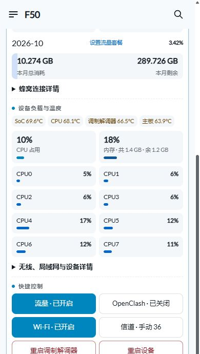

# 可选：首页美化与流量套餐面板

让 F50 的常用信息在手机上打开就能看见：大字号速率、单张双曲线、蜂窝用量、八核心负载和六个快捷控制。原生 OpenWrt 安装完成后，按需增加这套界面。

## 1. 复制给 Codex 的提示词

```text
给已安装 mu300-linux 的 F50 增加本仓库 docs/13-optional-dashboard.md 的可选首页优化。
先读取 README、versions.json、本章和 extras/dashboard/install.sh，识别实际版本、蜂窝接口、无线设备与管理连接。
本补丁匹配 v2026.10.11、OpenWrt 25.12.5、厂商 5.4 内核、sipa_eth0、radio0 / ap0 的 5GHz 无线。版本或接口不同，先适配差异；不要直接覆盖不匹配的页面。
电脑互联网继续走主路由网线，F50 USB 负责 SSH 管理。使用已有 SSH 配置，不公开密码、私钥、订阅或备份。
下载 / 准备代码与 vnstat2 依赖，核对 extras/dashboard/SHA256SUMS，备份原页面、后台采集脚本和配置，再部署。
保留当前密码、SSID、信道、套餐额度、历史数据库与 OpenClash 开关状态。没有安装 OpenClash 时显示“未安装”，本扩展不安装代理插件或导入订阅。
安装后用实际浏览器验证手机布局、CPU 总占用、内存、CPU0–CPU7、上下行曲线、两组累计、套餐设置、月度历史和快捷控制；核对流量求和及百分比。
核对自动 / 手动信道，测试后恢复原信道；重启类按钮检查确认流程，真正重启按当前任务安排。
记录本机备份路径、恢复命令与已验证结果，在本地 F50-progress.md 勾选。界面能用后再报告完成。
```

## 2. 手机首页有哪些变化

- **先看核心信息：** QCI、连接的基站与频段、上下行速率、温度、CPU 和内存常显；CPU0–CPU7 分别显示占用率。
- **大字号速率：** 蓝色下行与“5G SA”使用相同字号；橙色上行放在下方，略小一号。
- **一张双曲线：** 蓝 / 橙高对比线，3.5px 线宽；历史窗口由 40 点增到 80 点，点击或轻触查看采样时间、上下行速率。手机曲线高度 145px，纵轴三档数字、单位只显示一次。
- **两组流量：** 先显示“本次累计接收 / 发送”，再显示“本月累计接收 / 发送”。本次从当前启动的蜂窝接口计数读取，本月来自持久化数据库。
- **套餐进度条：** 左侧显示本月总消耗，右侧显示本月剩余；点击左侧编辑已使用，点击右侧编辑总流量。日期与百分比中间的“设置流量套餐”打开完整设置，点击日期查看月度历史。
- **六个快捷控制：** 流量、OpenClash、Wi-Fi、信道自动 / 手动、重启调制解调器、重启设备。
- **展开看详情：** 信号、蜂窝连接、无线 / 局域网 / 设备参数折叠；锁频、邻区锁定保留原有入口。

手机界面的负载与快捷控制实拍：



图中的速率、用量、温度属于截图时的读数；安装后由自己的设备实时采集，套餐总量由自己填写。

## 3. 准备与适用版本

- [ ] 主线安装已完成，LuCI、蜂窝连接与 USB SSH 正常。
- [ ] 核对 `/etc/mu300/image-version` 为 `v2026.10.11`，当前页面是 `view/mu300/home.js`。
- [ ] 核对 `/usr/libexec/unisoc-modem/dashboard-info`、蜂窝口 `sipa_eth0`、无线 `radio0 / ap0` 与 5GHz 配置。
- [ ] 使用 PowerShell、Python 3、Git 和电脑现有 OpenSSH；软件下载与准备交给 Codex。
- [ ] 保留当前 SSH Host 与管理地址，记录原信道和已有套餐设置。

这是一套固定版本的 **LuCI 首页与采集脚本补丁**。它更新前端、对应 RPC / ACL 和逐核心采集，不写启动槽、Android 分区或内核。Wi-Fi 信道由快捷按钮按当前国家码、频段和带宽筛选；安装本身保留当前无线设置。

新版本 mu300-linux 的页面、RPC 或无线结构变化时，先对照作者新版本适配。软件与底层驱动继续由 [dikeckaan/mu300-linux](https://github.com/dikeckaan/mu300-linux) 提供。

## 4. 安装依赖与部署

先在 F50 SSH 中核对软件源并安装统计工具：

```sh
cat /etc/mu300/image-version
ip link show sipa_eth0
apk update
apk add vnstat2
vnstat --version
```

本方案不安装额外内核模块。已有 vnstat2 时核对版本、接口和数据库即可。

在 **仓库根目录**的 Windows PowerShell 执行，`f50` 是前文设置好的 SSH Host：

```powershell
python .\extras\dashboard\deploy.py --host f50
```

没有 Host 别名时，可用 `--host root@192.168.50.1`，地址换成自己的管理地址。SSH 使用电脑现有配置与主机指纹校验，脚本不保存登录密码。

部署脚本用 Python 标准库打包，通过 SSH 原始字节传输；不依赖路由器 SFTP。设备端核对文件 SHA256 与版本，创建带时间戳的私有备份，再安装页面、采集脚本、RPC 与 ACL。

安装后重启 rpcd，因此网页需要重新登录；浏览器强制刷新首页。原有密码、SSID、信道和代理配置保持现有设置，套餐已有配置继续使用；首次安装额度为 0，打开“设置流量套餐”填写自己的总量。

- [ ] 安装输出了原页面备份目录与恢复命令。
- [ ] 浏览器重新登录后显示新首页。
- [ ] 更新本机进度清单，保存安装输出。

## 5. 月度用量怎样保存

- **统计范围：** 仅统计蜂窝口 `sipa_eth0` 的接收 + 发送，包含路由器自身流量；USB 与 Wi-Fi 转发不再重复累加。
- **持久存储：** vnStat 数据库放在 SD 根文件系统的持久路径。已有持久目录继续使用；原目录在 `/var` / `/tmp` 时，安装器迁移到 `/opt/vnstat`。新旧目录都有数据库时先处理合并，不覆盖历史记录。
- **自然月：** 每月 1 日开始新月份，额度沿用；月度历史自动保存。本扩展使用自然月账期。
- **已使用输入：** 修改“本月已使用”会保存当月校准差值，后续采样继续增加；只修改总量不会重置已用。月度接收 / 发送是实际接口记录，总消耗还包含已设置的校准值。
- **保存周期：** 每 5 分钟写入 SD，网页每 30 秒读取。突然断电可能丢失最近一个保存周期的数据，日常使用正常关机 / 重启。
- **起算时间：** 自动记录从启用采集开始，Android 运行期间的流量由套餐查询后填写已使用值补充。运营商计费按运营商查询核对。

曲线保存当前页面会话的最近 80 个采样点，刷新页面重新积累；月度数据库与套餐设置在 SD 上持续保存。曲线是速率，不是蜂窝测速结果；无需为了显示曲线额外消耗流量测速。

## 6. OpenClash 与 AdGuard Home 的可选联动

这个按钮只管理已经安装、已经配置好的 OpenClash。没有安装时显示“未安装”，其他面板功能照常使用。需要安装代理时进入 [OpenClash 可选章节](06-openclash.md)。

没有运行 AdGuard Home 时，按钮调用 OpenClash 自身启动 / 停止流程。有自定义 DNS 链时，核对停止代理后直连解析能恢复。

已经运行 AdGuard Home 时，本补丁沿用本次联动方案：dnsmasq → AdGuard Home `5353` → Mihomo `7874`。开关切换时同步 AGH 上游，关闭代理使用直连 DNS。先在本机配置 AGH API 地址和凭据：

```sh
uci set f50dashboard.main=main
uci set f50dashboard.main.adguard_url='http://192.168.50.1:3000'
uci commit f50dashboard
```

地址使用自己的 AGH 管理地址。由 Codex 在本机创建 `/etc/f50openclash-adguard.netrc`，内容格式为 `machine <AGH地址的主机部分> login <自己的用户名> password <自己的密码>`，权限设为 `600`。凭据只留在设备与自己的私有备份，不提交 GitHub。

如果 AGH 端口、Mihomo DNS 端口或 DNS 链与上面不同，先适配 `f50openclash-worker`，重新生成 SHA256，再部署。切换后核对核心状态、DNS 上游与正常网页访问；不以按钮颜色单独判断联网结果。

## 7. 实际验收与恢复

Codex 逐项检查后，在本机清单勾选：

- [ ] 360px / 390px 手机宽度没有横向溢出，CPU / 内存 / 八核心默认显示。
- [ ] 上下行两条曲线颜色、线宽、点击读数符合页面设计。
- [ ] 本次计数对应当前启动接口；本月接收 + 发送对应数据库，未校准时等于本月总消耗。
- [ ] 套餐总量可自己输入；保存后刷新页面，额度和已用基线仍在。
- [ ] 月度历史可打开，数据库在持久目录，重启后继续采集。
- [ ] 六个快捷按钮顺序正确，状态与后台一致。
- [ ] 自动 / 手动信道能应用，测试后恢复原设置。
- [ ] 重启类按钮有确认流程；实际重启按用户当前安排执行。
- [ ] 留存原页面、配置、安装输出与最终备份。

本次界面已在 360px / 390px 宽度检查；八核心数据、流量求和、百分比、设置保存、曲线读数、折叠区和信道自动 / 手动均经过实际页面检查。自动模式实测选到 157 / 80MHz，随后恢复手动 36；重启类按钮检查确认流程。

安装器输出的备份目录形如 `/root/f50-dashboard-backups/<时间戳>-<编号>`。恢复时使用自己实际输出的路径：

```sh
sh /root/f50-dashboard-backups/<实际目录>/restore.sh
```

恢复脚本还原原页面、采集脚本、RPC / ACL 和配置，并恢复 vnStat 之前的启用状态；流量数据库保留，不删除历史。重新登录并强制刷新页面。界面确认可用后再按 [完整备份章节](07-backup-and-restore.md) 保存最终系统。

## 8. Q&A

**页面出现 `factory yields invalid constructor`？** LuCI 模块要用 `baseclass.extend(...)` 返回构造器。本文模块已经按该格式实现；更新后检查浏览器实际页面，不以“文件已写入”作为完成标志。

**月度统计小于本次接收？** 两者起点不同：本次是开机接口计数，本月是启用 vnStat 后的月记录。页面已分开标注；不能把不同起点的数值直接比较。需要补充套餐此前使用量时，设置本月已使用。

**设置了已使用后，接收 + 发送与总消耗不完全相同？** 接收 / 发送保留自动采样值，总消耗包含手动校准差值；鼠标悬停总消耗可以查看字节数与校准标识。

**升级作者系统后怎样继续用？** 先核对新页面、采集脚本、RPC 与无线结构，适配本补丁再安装；升级前保留备份。不要把旧版整页覆盖到未经核对的新版本。

## 作者与代码许可

首页和系统采集基础来自 [dikeckaan/mu300-linux](https://github.com/dikeckaan/mu300-linux)，延续作者 MU300 面板与工具能力。本文补充手机布局、月度套餐面板、逐核心占用、快捷开关和部署 / 恢复脚本。

文档遵循本仓库 CC BY 4.0；`extras/dashboard` 代码按 [MIT 许可](../extras/dashboard/LICENSE) 提供，保留上游作者署名。
